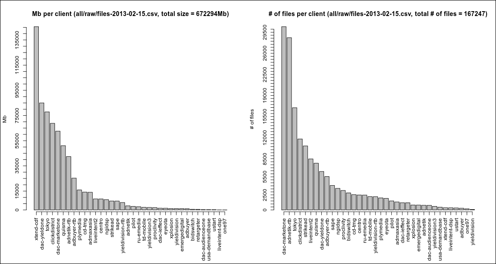

R is a great tool for visualising data. Recently I've got a chance to work on a
project which handles rather big amounts of data. I was told the data is big but
I've never seen any visuals myself. One day I decided to collect more
information about the data and plot some graphics.

<!-- more -->

Initially data was collected into csv files of the following structure:

```
client,type,subtype,size,name
bidswitch,aggregates,predict_price_2,114876,2013-02-15-00.bidswitch.prod.predict_price_2.tsv.gz
admaxasia,aggregates,budget_4,10398,2013-02-14_17:25:50.2013-02-15_00:15:00.admaxasia.prod.budget_4.tsv.gz
tokyo,logs,pixel,3802377,2013-02-15-19-30-00.CET.pixel_v36.userverlua-ireland22_338a1.log.gz
tokyo,logs,pixel,2695996,2013-02-15-19-30-00.CET.pixel_v36.userverlua-ireland25_a9a45.log.gz
```

Later the format has changed and a few fields were added: `mtime`, `user`,
`group`, `perm`. However in this acticle we will only need `client` and `size`
fields.

## Know your enemy

So basically what I wanted to know is what amounts of data are flowing through
the system? I was curious to know the number of files for each client and their
total size.

``` r
R> data <- read.csv('all/raw/files-2013-02-15.csv')
R> dim(data)
[1] 167247      5
R> names(data)
[1] "client"  "type"    "subtype" "size"    "name"   
R> length(list.files('all/raw'))
[1] 74
```

Not many files yet, but they're counting every day and we can see something
interesting today.

## First steps

My first step was to take standart plotting functions and get somewhat
acceptable plot where I can see the players. Being a novice in R I can say it
was not that easy. After a lot of googling I got my first working prototype
and it appeared to be quite lengthy and verbose.

``` r
#
# Plot number of files and total size of files per client from csv.
#
plotNullt <- function(file) {
    par(mfrow=c(1,2))

    d <- read.csv(file, head=T, colClasses='character')
    d$size <- as.numeric(d$size)
    sizes <- aggregate(d$size, by=list(client = d$client), FUN=sum)
    sizes$x <- sizes$x %/% (1024 ^ 2) # b to Mb
    total_size = sum(d$size) %/% (1024 ^ 2)
    total_files = nrow(d)

    # plot data size info
    K <- length(sizes$x)
    ord <- order(sizes$x, decreasing=T)
    par(oma=c(3,0,0,0))
    main <- sprintf('Mb per client (%s, total size = %dMb)', file, total_size)
    a <- barplot(sizes$x[ord], axes=F, ylab='Mb', main=main)
    m <- max(sizes$x)
    axis(side=1, at=a, labels=sizes$client[ord], las=3)
    axis(side=2, at=seq(0, m, 5000))

    # files per client
    clients <- unique(d$client)
    x <- sapply(clients, function(x) nrow(d[d$client == x, ]))
    lines <- data.frame(client=clients, files=array(x))

    # plot # of files info
    ord <- order(lines$files, decreasing=T)
    main <- sprintf('# of files per client (%s, total # of files = %d)', file, total_files)
    a <- barplot(lines$files[ord], axes=F, ylab='# of files', main=main)
    m <- max(lines$files)
    axis(side=1, at=a, labels=lines$client[ord], las=3)
    axis(side=2, at=seq(0, m, 500))
}
```

In this function we're plotting two plots. We use `par` and `mfrow` to specify
the number of rows and columns of subplots in our main plot.

Next we read the data from the file, making sure we get `size` column as numeric
values. It took me a while to figure out how to use `aggregate` the right way.
We use it to find the sum of file sizes for each client. This could probably be
implemented using powerful
[plyr](http://cran.r-project.org/web/packages/plyr/index.html) package but I'm
not familiar with it yet. It's one line of code for aggregation already which is
good enough. Next we divide aggregated sums by 1024 ^ 2 to represent values in
Mb. Total size and total number of files is also remembered.

After that we draw our first plot. The most challenging part here was to provide
correct ordering: I wanted clients to be sorted in a decreasing order of their
respective values, be it file sizes or number of files. Another tricky part was
to rotate the axis labels by 90 degrees and to add more ticks to the axis.
The former one was solved with `axis` function and `las` parameter. The latter
one was simpler and only required to use `at` and `seq`.

Next I'm using `sapply` to calculate the number of files per client. This is
weird and I don't know why I didn't use `aggregate` again, it could be much
simpler.

And pretty much the same story with the second plot. The code is basically the
same and except of a few different lines. The result looks as follows:

