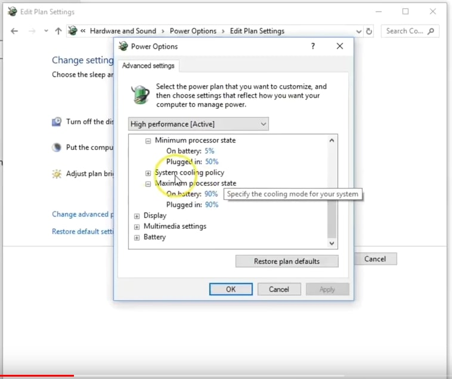

I have MSI GS65 laptop which is running Manjaro Linux.
Setting up nvidia drivers har been historically a huge pain, and after
one of the updates few months ago, one of the side effects was that
any moderate CPU load would cause the fans to go full blast. Besides
of reaching nearly 100 degrees Celsius, the noise was unbearable.

I tried attacking the problem several times, but to no avail. Recently,
I tried one more time, and this time I managed to reduce the fan noise and
the max temperature to consistent 70 degrees Celsius.

I'm not entirely sure what exact step fixed the problem, so I'll just
list all the things I've tried.

### 1. Windows, MSI Dragon Center

It was [suggested](https://www.youtube.com/watch?v=AJMiFLU_kjA) [multiple](https://old.reddit.com/r/MSILaptops/comments/gsol69/fixing_overheating_issue_msi_gs66/) [times](https://old.reddit.com/r/thinkpad/comments/k56fxe/reduce_maximum_processor_state_to_99_on_intel/) to fix something called "Maximum processor state"
in Windows settings. 



Specifically, to limit it to something below 100%, e.g. 90%. I switched to windows and did that -- miminum processor stat was set to **5%**, maximum to **90%**.

On top of that, in MSI Dragon Center, I changed the the **CPU profile** to Sport (or Turbo), I don't remember, and **battery** to "Save", which keeps the charge level at 50..60%.

### 2. Linux, auto-cpufreq

Install [auto-cpufreq](https://github.com/AdnanHodzic/auto-cpufreq). Here's my `/etc/auto-cpufreq.conf`:
```
[charger]
governor = powersave
scaling_min_freq = 800000
scaling_max_freq = 3000000
turbo = never
[battery]
governor = powersave
scaling_min_freq = 800000
scaling_max_freq = 2000000
turbo = never
```

I realize that limiting the top frequency limits the performance, but at least
I don't hear a plane taking off every other minute.

### 3. Linux, tlp

Uninstall `tlp`. I think this made the biggest difference.
For some miraculous reason, I had both `tlp` and `auto-cpufreq` installed.
I guess these are leftovers from my previous attempts to fix the problem.

### 4. Linux, thermald

Install `thermald`. I don't know if it had any effect, but they recommend installing
it alongside with `auto-cpufreq`, so I did it.

### `auto-cpufreq` output

After all these adjustments, here's my output of `auto-cpufreq --status`:
```
Battery is: charging

Setting to use: "powersave" governor

Total CPU usage: 19.9 %
Total system load: 3.81
Average temp. of all cores: 67.00 °C

Configuration file disables turbo boost
setting turbo boost: off
```